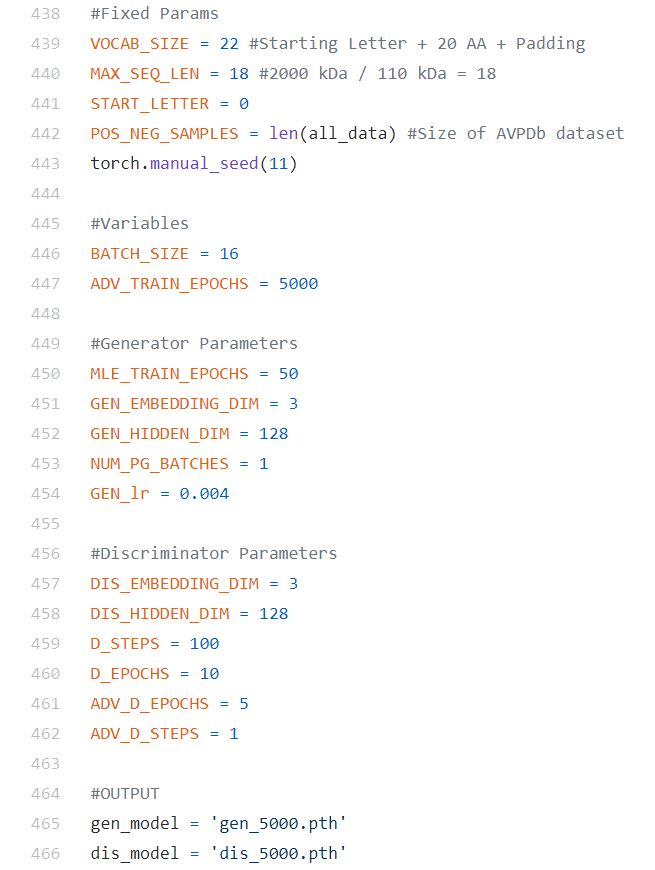

# Antiviral_SeqGAN

The models folder provided has three models available as ‘.pth’ files named after the number of adversarial epochs used when they were generated. The generator and discriminator are named respectively as follows:

1)	gen_1000.pth and dis_1000.pth 
2)	gen_5000.pth and dis_5000.pth 
3)	gen_20000.pth and dis_20000.pth 

The default version loaded is the gen_5000.pth and dis_5000.pth.

To use a pre-trained model, simply run:

python gan_generate.py

This will generate an output.txt file which lists the sequences. To modify the number of output sequences, or to change the model, open the code and scroll below to Line 438 and change the parameters. A snapshot of the location and parameters is given below:

To train your own model, first set your parameters by opening the ‘gan.py’ file and scrolling below to Line 438. Make any desired changes, including the name of the model.pth file you wish to save. Then, simply run:

python gan.py

This will save your named models in the ‘models’ directory, or any other path that you specify. This can then be used to generate outputs using the ‘gan_generate.py’ code. A snapshot of the location of the parameters is given below:

